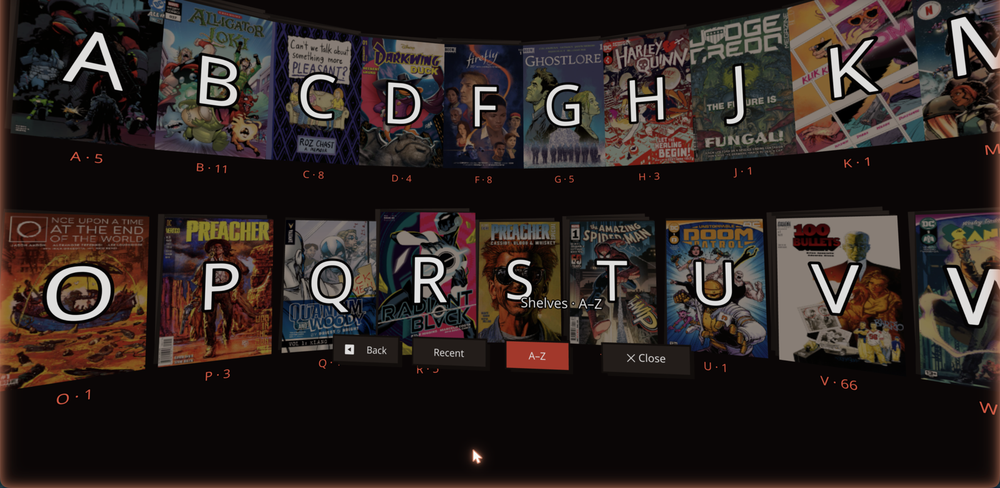
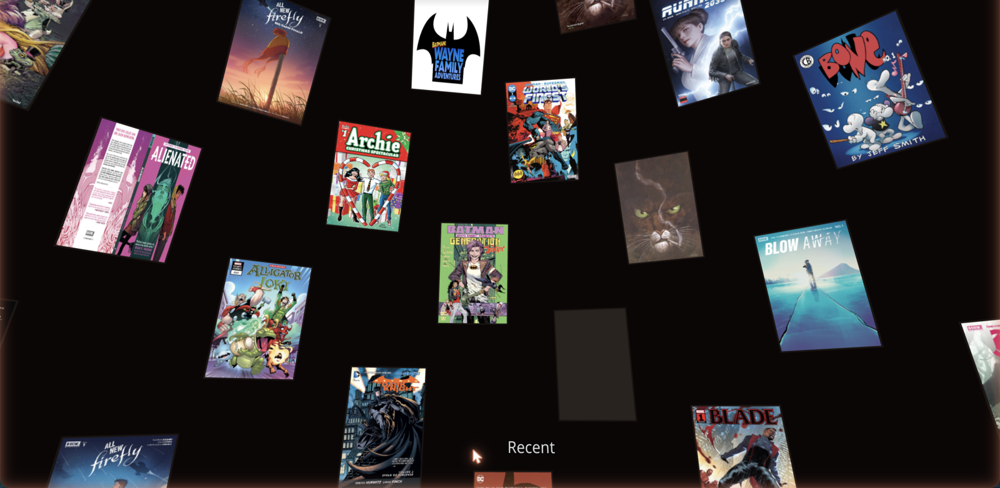

# Panel — WebXR comic reader for Komga

Panel streams a self-hosted [**Komga**](https://komga.org) comic library straight
into a Meta Quest 3 headset. Put the headset on and it opens where you left off on
the iPad; browse your whole library as a wall of floating covers; turn pages on
the thumbstick. It runs in the Quest browser — no store, no native build, no
sideload — and self-hosts as a single Docker container next to Komga.



> **Status:** v0.2.0 — self-hostable and on Docker Hub. Single-user / family
> focused, young but real. See [CHANGELOG.md](CHANGELOG.md).

## Features




- **Auto-resume** — reopens your last book fresh from Komga on load, so progress
  read anywhere (e.g. the iPad) carries over with zero clicks. Read-progress syncs
  back on every page turn.
- **A 3D library** — browse the whole collection as an **A–Z "Alphabet Shelf"**:
  letter stacks sized by how much you have under each, pick a letter to be
  surrounded by its series, drill into a series' issues, page through big sets.
  Plus a **Recent** mode (continue-reading + on-deck) and a flat 2D browser.
- **A comfortable reader** — the page composited crisp on a plane with a backing
  board + paper stack so it reads as a physical object; single-page and two-page
  spreads; grab-to-move, two-handed resize, stick locomotion, recenter.
- **Comic-shop-pulp look** — warm-black palette, one pulp-red accent, chunky
  display type, halftone and hard-offset "misregistration" shadows.

## Self-hosting (Docker)

Panel ships as one container: the static app + a Caddy proxy that talks to your
Komga with the API key injected server-side (so the browser never sees it).

```bash
docker run -d --name panel -p 8677:80 \
  -e KOMGA_URL="http://192.168.1.10:8080" \
  -e KOMGA_API_KEY="your-read-only-komga-key" \
  -e PANEL_PASSWORD="a-strong-password" \
  --restart unless-stopped \
  dervish/panelsxr:latest
```

**Two things to get right:**

1. **WebXR needs HTTPS.** A plain `http://…:8677` loads the 2D page but the Quest
   won't enter VR — front Panel with a reverse proxy / tunnel (SWAG, Nginx Proxy
   Manager, Cloudflare Tunnel) so it's served over `https://`.
2. **Gate it.** The proxy injects your Komga key, so an ungated public Panel is an
   open proxy to your library. Panel is **fail-closed**: it won't serve `/komga`
   unless you set `PANEL_PASSWORD` (built-in login, cached one-time by the Quest)
   or explicitly `PANEL_AUTH=none` (LAN-only / gated upstream). Use a **dedicated
   read-only Komga user's** key to cap the blast radius.

Full guide, env reference, and an **Unraid Community Applications** template:
[`deploy/unraid/`](deploy/unraid/).

## Hosting it for others (Cloudflare Worker, bring-your-own-Komga)

The container is single-tenant — one deploy, one Komga, your key in its env. The
**Cloudflare Worker** target is the opposite: **one deployment that anyone can
use with their own server.** The same Worker serves the app and proxies `/komga/*`
to each visitor's own Komga; their server URL + API key live in a first-party
cookie **on their device**, never in a database. No accounts, no login screen, and
nothing for you to maintain per user.

```bash
wrangler login
wrangler kv namespace create PANEL_PAIR   # paste the id into wrangler.jsonc
npm run deploy                            # builds (VITE_BYO=1) + wrangler deploy
```

First run on a headset uses a **phone pairing** handoff so nobody types an API key
on the Quest keyboard: the headset shows a short code, the user finishes at
`/pair` on their phone, and the config lands on the headset (brokered through a
single-use, 5-minute KV slot). A manual-entry path is there for keyboard devices.

**Know the trade-offs:**

1. **Internet-reachable Komga only.** A CF edge Worker can't route to a `192.168.x`
   LAN box — that's what the Docker container is for. Public hostname / Cloudflare
   Tunnel over HTTPS works (e.g. `komga.example.com`).
2. **The key transits the Worker** (encrypted, never stored) — inherent to any
   proxy. If you need the key to *never* leave the device, that's a different
   (client-direct) design with its own costs; this one optimises for zero setup.
3. **It's a public proxy**, so the Worker enforces a **read-only allowlist**
   (`worker/guard.ts`) and refuses private/loopback upstreams. Consider adding
   Cloudflare rate-limiting rules if you expect real traffic.

Local end-to-end test (real Worker in workerd, IWER emulator on `localhost`):

```bash
npm run dev:worker   # build + wrangler dev on http://localhost:8787
```

## Development

```bash
npm install
npm run dev          # http://localhost:5173 — desktop iteration
npm run dev:quest    # HTTPS on the LAN for a real headset (self-signed)
npm run build        # tsc --noEmit && vite build
npm test             # vitest — headset-independent logic
```

On localhost with no WebXR, `@react-three/xr` v6 auto-activates an emulated Quest
3 (IWER), so `Enter VR` gives a real emulated session on desktop. Set your Komga
connection in `.env.local` (copy `.env.example`); the dev server proxies
`/komga/*` and injects the key, same as the container.

## Tech

Vite + React 19 + TypeScript · three.js · @react-three/fiber · @react-three/xr v6
(`createXRStore`, controller/hand input state) · @react-three/handle · drei ·
JSZip (dev-only `.cbz`). Deploy: single Docker container (multi-stage → Caddy) or
a Cloudflare Worker (static assets + `/komga` proxy, bring-your-own-Komga). Node 22.

## License

MIT.
